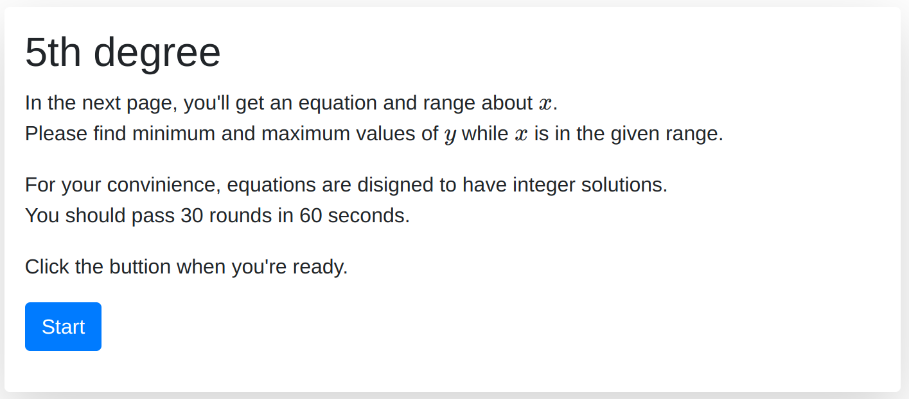
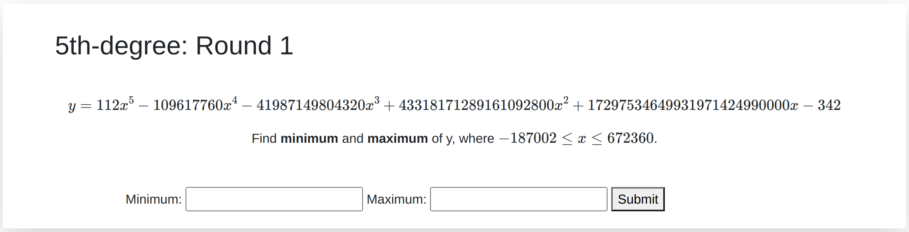

# 5th degree

## Description
```
It's highschool math.

Server: http://5thdegree.sstf.site
```

## Solution


It looks like a simple coding challenge and we'd better keep in mind below.

```
For your convinience, equations are disigned to have integer solutions.
```


We get the polynomial with giant coefficients.



After googling, I found [the solution](https://stackoverflow.com/a/31223062) which fits exactly to this challenge. It leverages `numpy.poly1d` and `scipy.optimize.minimize_scalar`. There was no API for maximizing, but the reason might be we could just multiply polynomial by -1.

At the first time, I wasn't able to pass even round 1. All looks good since the all `x` value found was quite close to the integer like the hint said. After debugging with @KSAlpha, we figured out that we were using `numpy.float64` and there is some preicision issues. After we manually calculate `y` values, we managed to pass the round 1.

Not sure why, but it fails to pass sometimes. However, instead of investing more time on debugging, I just let it try infinitely and got lucky.

```sh
$ while true; do python exploit.py; done | grep SCTF
                <h1>SCTF{I_w4nt_t0_l1v3_in_a_wOrld_w1thout_MATH}</h1>
```

## Flag
`SCTF{I_w4nt_t0_l1v3_in_a_wOrld_w1thout_MATH}`