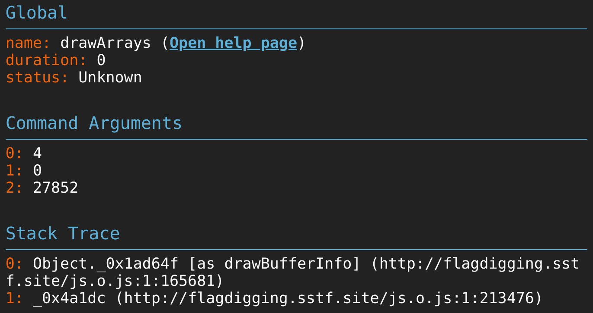

# Flag Digging

## Description

## Solution


There was WebGL-rendered rotating flag. Since @KSAlpha and I both have no experience on WebGL, we start with the tutorials and managed to interact with `WebGLRenderingContext`.

We wanted to try ideas like below.
- Remove only the covering
- View flag vertically (with the assumption that there will be no roof since it was rotating horizontally)

In `WebGL 1.0`, there was no API which exactly fits to our idea. However, @KSAlpha suggests the clever idea which achieves the partial goal, but enough to get flag.

`count`, which is the 3rd arguemnt of [WebGLRenderingContext.drawArrays](https://developer.mozilla.org/en-US/docs/Web/API/WebGLRenderingContext/drawArrays), specifies the number of indices to be rendered. Thus, if we lower this, we might see thorugh insufficiently rendered coverings, though even flag would look dimly too.

Meanwhile, the javascript source was obfuscated and we needed to deobfuscate it. Unfortunately, we couldn't find `WebGLRenderingContext.drawArrays` after using some online tool. @KSAlpha, again, found useful Chrome extension for [Spector.js](https://spector.babylonjs.com/) and it kindly told us the location of it.



Designated code is like below, and let's change the 3rd arguments from `_0x24abf8` to `15000`. After that, we copied all the javascript source and reload it via the console.

```javascript
_0x324958[_0x26b62b(0x218,'\x70\x45\x33\x43')](_0x2da37f,_0x8c4c9e,_0x24abf8);
```

The result is like below and we can get the flag with eye popping. We are not sure this is the intended solution or not, but this works.


## Flag
`SCTF{pay_m0n3y_t0_get_asset}`