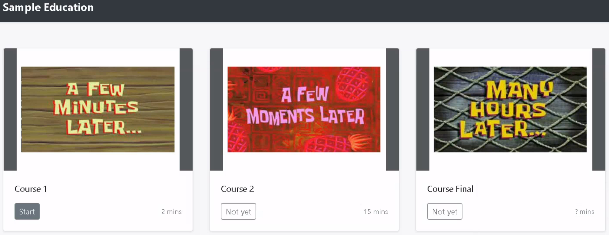

# Online Education

## Description

## Solution

It's a `Coursera` like service, which issues certificates for the completed courses. It seems `Course Final` would take a lot of time.



We need to take all courses in order.

```python
@app.route('/cert')
@login_required
def cert():
    if session['idx'] < len(course_data['vids']):
        return 'No!'
    # ...
```

It seems we cannot skip the video, but we can't waste that much time for this proof of work (or nothing)! Fortunately, we can bypass and finish all courses in even less than 1 second. We just give negative `rate`.

```python
        elif action == 'finish':
            rate = float(params['rate'])
            if rate > 1.5:
                result['msg'] = 'Why are you so fast?'
            else:
                passed_time = time.time() - session['start']
                if (video['length'] / rate) < passed_time + 3:
                    session.pop('start', None)
                    session['idx'] += 1
                    result['msg'] = 'Good Job!'
                else:
                    result['msg'] = 'Do not skip video!'
```

Finally, I can issue the certificate, upload to my `LinkedIn` and rest. No! We need to dig into what we can do with the certificate. It could be possible to do SSRF while generating pdf.

```python
def make_certificate(name, email, course, author):
    # ...
    # Cool! HTML to PDF
    pdf = pdfkit.from_string(html, options=options)
```

According to the [article](https://www.sidechannel.blog/en/html-to-pdf-converters-can-i-hack-them/index.html#95dc), `PDFKit` enables javascript by default and loads external contents. It sounds it is the perfect target for SSRF.

We can only control `name` and `email`, but `name` cannot have special characters while `email` is not. It just needs `foo@bar.baz` like string in it and have no other limits, which means we can inject arbitrary XSS payload.

```python
def check_email(email):
    regex = '[A-Za-z0-9._+-]+@[A-Za-z0-9.-]+\.[A-Z|a-z]{2,}'
    if re.match(regex, email) == None:
        flash("Invalid Email")
        return False
    return True

def check_name(name):
    charset = string.ascii_letters + ' '
    for c in name:
        if c not in charset:
            flash("Invalid Name")
            return False
    return True
```

At this point, I thought I can read the flag with `XMLHTTPRequest` and I'm done. It turns out the flag file has renamed with the unknown hash according to the `Dockerfile`.

```sh
RUN mv flag flag_`md5sum flag | cut -d' ' -f1`
```

Since I cannot read the directories or do RCE with the current primitives, I needed some way around. It turns out there was a magic function for flag. I can get `admin_hash` from `config.py` and might be able to find the input for `admin_hash`. However, it was not the case unfortunately.

```python
@app.route('/signin', methods=['POST'])
def signin():
    # ...
            session['is_admin'] = hashlib.md5(name.encode()).hexdigest() == admin_hash
    # ...

@app.route('/flag')
@login_required
def flag():
    ### CTF stuff ###
    if session['is_admin']:
        flash(os.popen('cat flag*').read().strip())
    else:
        flash("you are not an admin, {}".format(session['name']))
    return redirect('/')
```

There is one more thing we can try. Besides the `admin_hash`, we have `secret_key` in `config.py`, which is the secret key of `Flask` app. I was able to read the flag with new cookie generated via `flask_unsign` with the secret key. The little detail here is that since it is sending the flag via `flash`, you should look for the HTTP response header.

## Flag
`SCTF{oh_I_forgot_to_disable_javascript}`