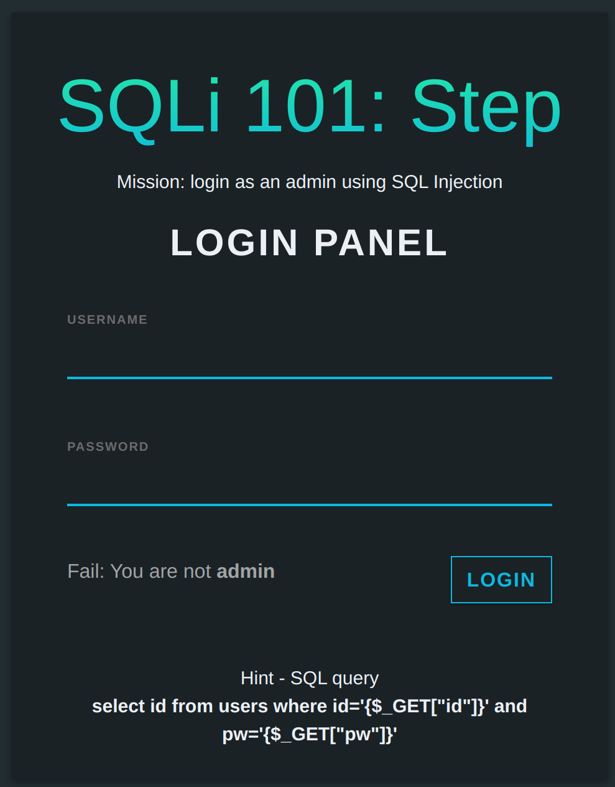

# SQLi101

## Description
```
Hi there!

It's time to learn about SQL injection, a famous and representative web attack skill.

The server is running at: http://sqli101.sstf.site/step2.php.

This is a tutorial challenge from Hacker's Playground 2020.
If you are not sure how to solve this,
please refer to the tutorial guide(Eng | Kor).
```

## Solution
The site has login form and it gives us the hints when we submit any credentials. According to the hint, we need to do the very classic SQLi so that we could login as `admin`.



If we give below as `username`, we can login as `admin` and get the flag.
```
admin' -- -
```


## Flag
`SCTF{th3_f1rs7_5t3p_t0_the_w3B_h4ckEr}`